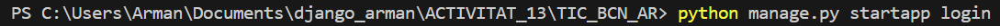
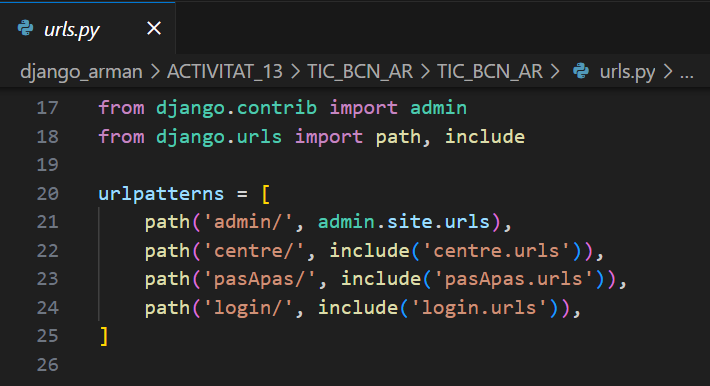
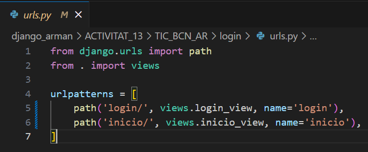

Activitat 14 Commit 1: Configuració  projecte

Connectar amb la nova aplicació un cop creada.

Treballar amb postgresql.

Afegir  templates a la configuració.

Activitat 14 Commit 2: creació de l’aplicació

Captura de la comanda per crea la nova aplicacio

En TIC_BCN_AR/urls.py posem la url 

En la aplicacio de nom "login" login/urls.py posem les urls

